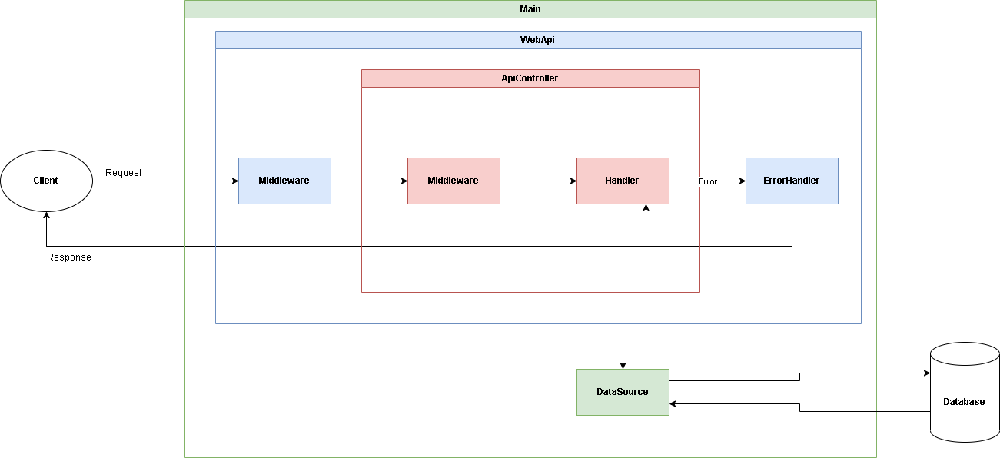

# express-webapi
## Description
This is an initial source for Web API using Typescript.

To run the project, use the following commands:
```shell
# Dev
npm run dev

# Build
npm run build

# Start
npm start
```
## Structure
This project has the following structure:

Implement the organization as below:
```
src
  |
  core
  controllers
  database
    |
    migrations
    models
  main.ts
.env
```
## Core
The `core` folder contains the following files:
- `api-controller.ts` - provides the base for controller
- `dto-mapper.ts` - provides DTO mapping functions
- `error-handler.ts` - provides error handling
- `globals.ts` - defines environtment/global variables
- `logger.ts` - defines the Logger class
- `swagger-docs.ts` - provides default config for Swagger
- `upload.ts` - file upload with Multer
- `web-api.ts` - provides the app base

In addition, there is the file `main.ts` outside `core` folder and inside `src` folder. This file contains `Main` class which is exported with some useful static properties:
- `Application` - the application itself
- `DataSource` - database access
- `Logger` - global logger
## Global Variables
You can put all your environment and global variables into `globals.ts` within the `core` folder. 
## Controller
The `controllers` folder contains all of your controller. Each controller has its own request handlers. To define a controller, create a sub-folder inside the `controllers` folder and create a new controller file. For example:
```
# Define Authentication Controller

controllers
  |
  auth
    |
    auth.controller.ts
```
Content of the file:
```typescript
import { NextFunction, Response } from "express";
import ApiController, { Request, HttpMethod } from "../../core/api-controller";

export default class UserController extends ApiController {
    constructor() {
        super("/auth");

        this.addHandler(HttpMethod.GET, "/", this.test);
    }

    async test(req: Request, res: Response, next: NextFunction) {
        return res.status(HttpStatusCode.OK).send("Test Auth");
    }
}
```
Note that `Request` is imported from `core/api-controller.ts`.

You can use `DtoMapper`, which is built from `class-validator` and `class-transformer`, to validate and convert your request body, query or params to your desired type. Example:
```typescript
import { IsEmail, IsNumber } from "class-validator";

export default class TestDto {
  @IsEmail()
  email: string;

  @IsNumber()
  testNumber: number;
}
```
Then, add the middleware to your handler like this:
```typescript
export default class UserController extends ApiController {
    constructor() {
        super("/auth");

        this.addHandler(HttpMethod.GET, "/", this.test, DtoMapper.fromBody(TestDto));
    }

    async test(req: Request, res: Response, next: NextFunction) {
        return res.status(HttpStatusCode.OK).send("Test Auth");
    }
}
```
Finally, add an instance of your controller to `main.ts` here:
```javascript
static async init() {
  // Other initializations

  // -----------------------------

  this._application = new WebApi(Globals.APP_PORT, [
    // Add your controllers here
    new YourController()
    // -------------------------
  ]);
}
```
## Model
For database, you can learn TypeORM [here](). You can find some data source configs in `datasource.config.ts` and the data source for app is in `app-data-source.ts`.
```shell
# Generate migration
npm run typeorm:gen

# Run migration
npm run typeorm:run
```
You can access database by using `Main.DataSource`